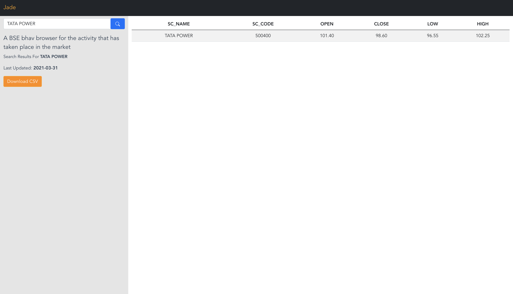

# [Jade](https://github.com/prtm/jade) Frontend


A BSE bhav browser for the recent activity that has taken place in the market.

## Features

* Powered by VueJs
* Get the sorted bhav data
* Search with suggestions
* Download search results as csv


## Table of Contents
- [Jade Frontend](#jade-frontend)
  - [Features](#features)
  - [Table of Contents](#table-of-contents)
  - [Screenshots](#screenshots)
  - [Installation](#installation)

## Screenshots




## Installation

1. Install dependencies
```shell
yarn
# OR npm install
```
2. copy env file
```shell
cp docs/env_example .env
```
3. Run
```shell
$ yarn dev
# OR npm run dev
```